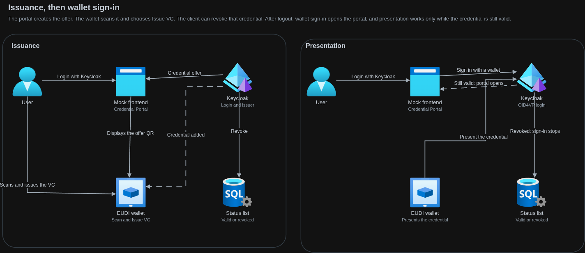

# Keycloak SSO & OID4VC Demo

This project is a React application that demonstrates how to integrate Keycloak for Single Sign-On (SSO) and interact with an OID4VC (OpenID for Verifiable Credentials) service. It provides a basic setup for user authentication and a protected dashboard page.

## Features

- **User Authentication:** Login and logout functionality using Keycloak SSO.
- **Protected Routes:** A dashboard page that is only accessible to authenticated users.
- **OID4VC Integration:** A service to interact with an OID4VC provider.
- **Issued Credential Revocation:** A client-driven flow for revoking issued credentials through Keycloak.
- **Modern Tech Stack:** Built with React, Vite, and Tailwind CSS.

## Flow Documentation

- [Credential issuance and revocation flow](docs/credential-issuance-and-revocation-flow.md)

## Architecture

The first login is username and password on the Keycloak page. This app then shows the Credential Portal, where the user scans an offer QR and the wallet receives a credential. That credential is listed in the client. After logout, **Sign in with a wallet** shows a presentation QR. Scanning the credential that is still valid logs the user back into the Credential Portal. Revoke on the Credentials tab is separate: if that credential was revoked, the same scan is rejected. The wallet QR and the status check belong to the OID4VP plugin, not to this app.



## Getting Started

These instructions will get you a copy of the project up and running on your local machine for development and testing purposes.

### Prerequisites

- [Node.js](https://nodejs.org/) (v18 or higher recommended)
- [npm](https://yarnpkg.com/) package manager
- A running Keycloak instance with a configured realm and client.

### Installation

1.  Clone the repository:

    ```bash
    git clone https://github.com/ADORSYS-GIS/keycloak-oid4vc-mock-fe.git
    cd keycloak-oid4vc-mock-fe
    ```

2.  Install the dependencies:
    ```bash
    npm install
    ```

### Configuration

1. Using `.env.example` as a template, create a `.env` file in the root of the project and update the variables with the correct values:
   ```bash
   cp .env.example .env
   ```

### Running the Application

To start the development server, run the following command:

```bash
npm run dev
```

The application will be available at `http://localhost:3000`.

## Available Scripts

In the project directory, you can run:

- `npm run dev`: Runs the app in the development mode.
- `npm run build`: Builds the app for production to the `dist` folder.
- `npm run lint`: Lints the codebase using ESLint.
- `npm run preview`: Serves the production build locally for preview.

## License

This project is licensed under the GNU Affero General Public License v3.0 (AGPL-3.0-only).
See [LICENSE](./LICENSE) for details.
