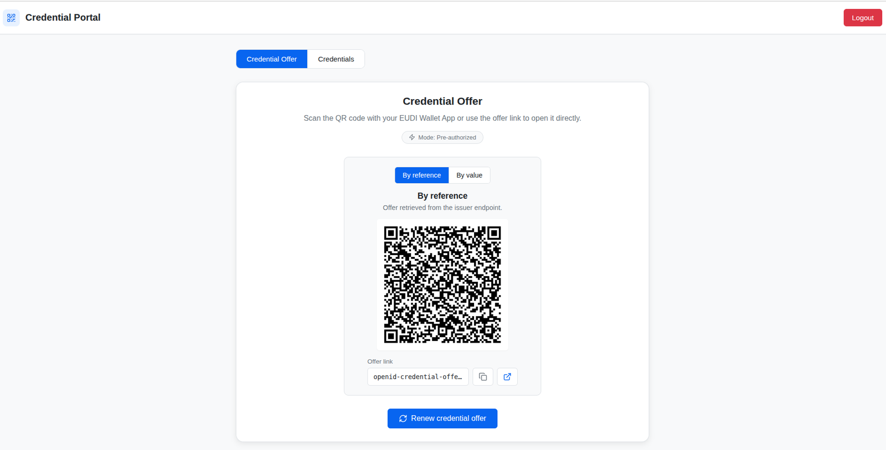
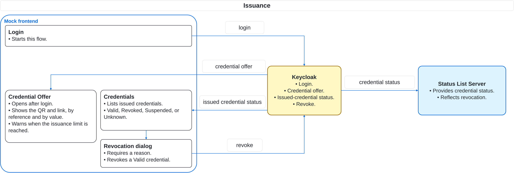
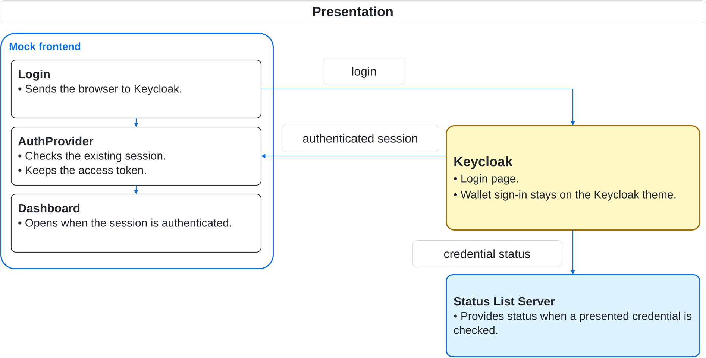

# Keycloak SSO & OID4VC Demo

This project is a React application that demonstrates how to integrate Keycloak for Single Sign-On (SSO) and interact with an OID4VC (OpenID for Verifiable Credentials) service. It provides a basic setup for user authentication and a protected dashboard page.



## Features

- **User Authentication:** Login and logout functionality using Keycloak SSO.
- **Protected Routes:** A dashboard page that is only accessible to authenticated users.
- **OID4VC Integration:** A service to interact with an OID4VC provider.
- **Issued Credential Revocation:** A client-driven flow for revoking issued credentials through Keycloak.
- **Modern Tech Stack:** Built with React, Vite, and Tailwind CSS.

## Flow Documentation

- [Credential issuance and revocation flow](docs/credential-issuance-and-revocation-flow.md)

## Architecture

These diagrams show the main flows handled by the client application. Keycloak and the Status List Server are external to the application and are shown as separate components to make the integration boundaries clear.

### Issuance

The flow starts with user authentication. After login, the Credential Offer flow is opened. The application obtains the credential offer from Keycloak and displays it as either a QR code or a link, supporting both by-reference and by-value offers. The application also displays a warning when the issuance limit is reached.

The Credentials view lists the credentials issued to the user. The application retrieves the credential status through the credential status flow and displays it as Valid, Revoked, Suspended, or Unknown. The Status List Server is responsible for providing the status information used to determine the current state of a credential.

For a Valid credential, the user can open the revocation dialog, provide a reason, and submit the revocation request. The resulting status change is reflected through the Status List Server.



### Presentation

The presentation flow starts with authentication, which redirects the browser to Keycloak. The AuthProvider checks the authentication session and maintains the access token. Once the session is authenticated, the user is redirected to the Dashboard.

Wallet-based sign-in is handled through the Keycloak login theme. It is therefore part of the Keycloak authentication flow and is not a screen rendered by this application.

The Status List Server is also part of the credential verification flow, providing the status information required when checking whether a presented credential is currently valid.



## Getting Started

These instructions will get you a copy of the project up and running on your local machine for development and testing purposes.

### Prerequisites

- [Node.js](https://nodejs.org/) (v22 or higher)
- [npm](https://yarnpkg.com/) package manager
- A running Keycloak instance with a configured realm and client.

### Installation

1.  Clone the repository:

    ```bash
    git clone https://github.com/ADORSYS-GIS/keycloak-oid4vc-mock-fe.git
    cd keycloak-oid4vc-mock-fe
    ```

2.  Install the dependencies:
    ```bash
    npm install
    ```

### Configuration

1. Using `.env.example` as a template, create a `.env` file in the root of the project and update the variables with the correct values:
   ```bash
   cp .env.example .env
   ```

### Running the Application

To start the development server, run the following command:

```bash
npm run dev
```

The application will be available at `http://localhost:3000`.

## Available Scripts

In the project directory, you can run:

- `npm run dev`: Runs the app in the development mode.
- `npm run build`: Builds the app for production to the `dist` folder.
- `npm run lint`: Lints the codebase using ESLint.
- `npm run preview`: Serves the production build locally for preview.

## Compatibility

This application has been tested with:

| **Requirement** | **Version** |
| --------------- | ----------- |
| **Keycloak**    | 26.7.3      |

While it may work with other versions, compatibility is not guaranteed. Ensure your environment matches the tested versions for best results.

## Versioning

This project follows [Semantic Versioning](https://semver.org/). The current version is `0.1.0`, defined in `package.json`.

Releases are identified by Git tags in the format `vX.Y.Z`, matching the version in `package.json`.

To create a release:

1. Bump the `version` field in `package.json`.
2. Commit the version change.
3. Tag that commit as `vX.Y.Z`.

## License

This project is licensed under the GNU Affero General Public License v3.0 (AGPL-3.0-only).
See [LICENSE](./LICENSE) for details.
