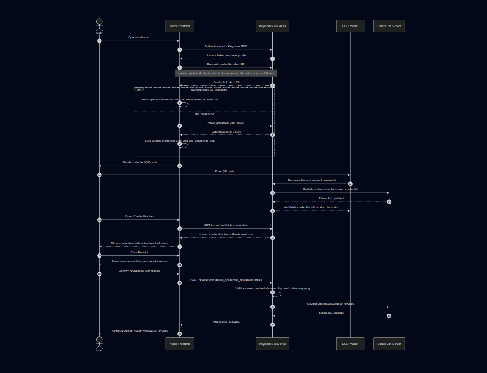

# Credential Issuance and Revocation Flow

This document describes how the mock frontend participates in credential issuance, issued credential listing, and issued credential revocation.

The key change in this flow is that revocation is initiated from the client application against Keycloak's issued credential revocation endpoint. The wallet no longer owns the revocation action.

## UI Flow

The dashboard has two top-level tabs:

- `Credential Offer`: displays a single QR code at a time. `By reference` is the default view and appears before `By value`.
- `Credentials`: lists issued credentials for the authenticated user and exposes the `Revoke` action.

The credential offer QR code can be toggled between:

- `By reference`: encodes `openid-credential-offer://?credential_offer_uri=...`
- `By value`: encodes `openid-credential-offer://?credential_offer=...`

Only one QR code is rendered at a time so the page stays compact and the user does not need to scroll between two QR cards.

## Client Responsibilities

The frontend is responsible for:

- authenticating the user through Keycloak;
- requesting credential offer links from Keycloak;
- rendering the selected QR code variant;
- loading issued credentials for the authenticated account;
- collecting a revocation reason before sending the revocation request;
- keeping a revoked credential visible in the UI with status `revoked`.

The frontend is not responsible for:

- deciding whether the user owns the credential;
- directly updating the status list server;
- directly talking to the wallet during revocation;
- validating credential status during presentation.

Those checks and state changes belong to Keycloak, the OID4VC plugins, the wallet, and the status list server.

## API Calls Used By The Client

### Create Credential Offer

The client first tries the Keycloak 26.6+ endpoint:

```text
GET /realms/{realm}/protocol/oid4vc/create-credential-offer
```

Query parameters:

```text
credential_configuration_id={credentialType}
target_user={preferred_username}
pre_authorized=true
```

If that fails, the client falls back to the older endpoint:

```text
GET /realms/{realm}/protocol/oid4vc/credential-offer-uri
```

Query parameters:

```text
credential_configuration_id={credentialType}
username={preferred_username}
```

### Load Issued Credentials

```text
GET /realms/{realm}/account/issued-verifiable-credentials
```

The response is displayed in the `Credentials` tab. The UI uses the credential `id` as the revocation target and displays:

- credential type;
- issued timestamp;
- revision;
- wallet client;
- status.

The account endpoint does not carry revocation status, so the dashboard also fetches the token status plugin's view and merges it in:

```text
GET /realms/{realm}/status-list/issued-credential-status
```

Without a `target_user` parameter the plugin resolves the caller from the bearer token. An entry marked `INVALID` pins the credential as `revoked` in the UI, so revocations from any portal (self or admin) are reflected everywhere. If this lookup fails, the list still renders from the account endpoint and local view state.

### Revoke Issued Credential

```text
POST /realms/{realm}/status-list/revoke
Content-Type: application/x-www-form-urlencoded
```

Form body:

```text
mode=issued_credential_revocation
credential_id={issuedCredentialId}
reason={userProvidedReason}
```

After a successful response, the frontend marks the credential as `revoked` locally and keeps it visible. This is intentional: a revoked credential should remain auditable in the UI instead of disappearing from the list.

## Sequence Diagram



## Revocation Behavior

Revocation is scoped to issued credentials, not to credential offers. A single available credential can produce multiple issued credentials across wallets. Revoking one issued credential should update the status list entry for that issued credential only.

The revocation action must remain server-authoritative:

- Keycloak must verify that the authenticated user is allowed to revoke the issued credential.
- Keycloak must find the status list mapping for the issued credential.
- Keycloak must update the status list server.
- The frontend only reflects the successful server response.

## Admin-Initiated Flows (Admin Mode)

A user holding the realm role `credential-offer-create` gets an "On behalf of user" dropdown listing all realm users loaded from Keycloak's Admin REST API; the logged-in user's own entry appears first as the default, keeping the dashboard scoped to their account. The role gate is a UI convenience only — the server must enforce the role for any request that targets another user.

### Create an Offer for Another User

Same calls as above, with the target parameter set to the selected username instead of the logged-in user:

```text
GET /realms/{realm}/protocol/oid4vc/create-credential-offer
    ?credential_configuration_id={credentialType}
    &target_user={selectedUsername}
    &pre_authorized=true
```

with the pre-26.6 fallback `username={selectedUsername}` on `credential-offer-uri`. Keycloak rejects the request with a `403` unless the caller holds `credential-offer-create` when the target differs from the caller.

### List Credentials Issued to Another User

The admin list uses the token status plugin endpoint instead of the account endpoint, so it can report the real server-side status:

```text
GET /realms/{realm}/status-list/issued-credential-status?target_user={selectedUsername}
```

The response wraps entries in a `credentials` array with `credentialId`, `verifiableCredentialId`, `issuedAt`, `expiresAt`, `clientId`, `revision`, and `status` (`VALID`, `INVALID`, `SUSPENDED`, or `UNKNOWN`). The frontend maps `credentialId` to its `id` field and displays `INVALID` as revoked (non-revocable); `VALID`, `SUSPENDED`, and `UNKNOWN` stay revocable.

### Revoke a Credential Issued to Another User

The revocation call is the same form as the self-service one with an extra field identifying the target user (only included when targeting another user):

```text
POST /realms/{realm}/status-list/revoke
Content-Type: application/x-www-form-urlencoded

mode=issued_credential_revocation
credential_id={issuedCredentialId}
reason={userProvidedReason}
target_user={selectedUsername}
```

After a successful response the frontend marks the credential `revoked` under the target user's view state, so it stays visible and auditable in the admin list.

## Presentation Status Check

When the credential is later used during presentation, the verifier follows the `status_list` claim embedded in the credential:

```json
{
  "status_list": {
    "idx": 0,
    "uri": "https://status-list-server.example/status-lists/{id}"
  }
}
```

The verifier fetches the status list token, validates its signature and certificate chain, and checks the credential index. If the credential was revoked, presentation validation should fail.

## Testing Checklist

1. Log in to the client app.
2. Confirm `Credential Offer` opens with `By reference` selected.
3. Toggle to `By value` and confirm the QR code and link are replaced in place.
4. Issue a credential to the wallet by scanning the QR code.
5. Open `Credentials`.
6. Confirm the issued credential appears with status `active`.
7. Click `Revoke`.
8. Confirm the dialog requires a revocation reason.
9. Submit the revocation.
10. Confirm the credential remains visible with status `revoked`.
11. Try presenting the revoked credential and confirm status validation rejects it.
