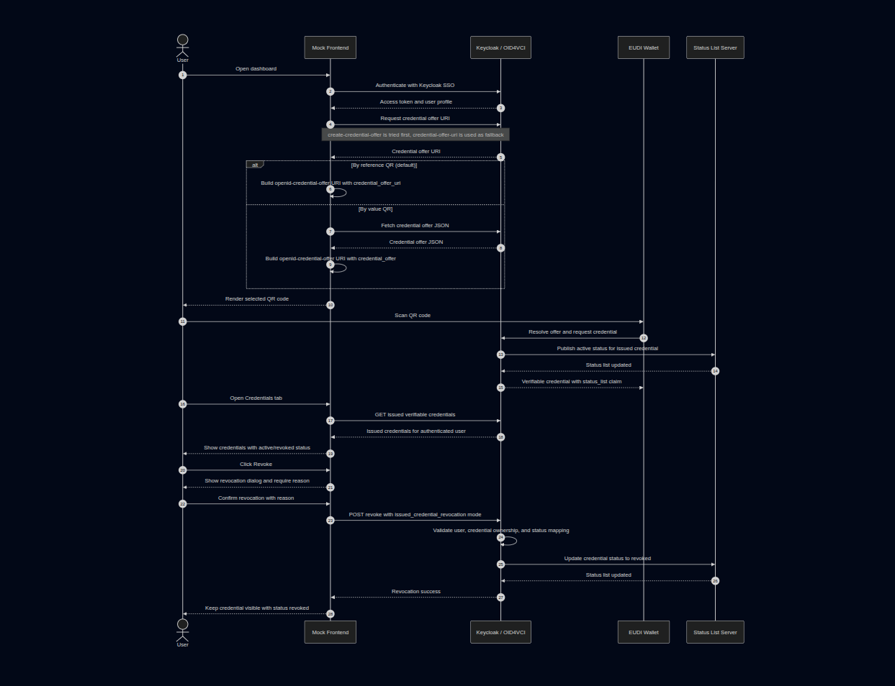

# Credential Issuance and Revocation Flow

This document describes how the mock frontend participates in credential issuance, issued credential listing, and issued credential revocation.

The key change in this flow is that revocation is initiated from the client application against Keycloak's issued credential revocation endpoint. The wallet no longer owns the revocation action.

## UI Flow

The dashboard has two top-level tabs:

- `Credential Offer`: displays a single QR code at a time. `By reference` is the default view and appears before `By value`.
- `Credentials`: lists issued credentials for the authenticated user and exposes the `Revoke` action.

The credential offer QR code can be toggled between:

- `By reference`: encodes `openid-credential-offer://?credential_offer_uri=...`
- `By value`: encodes `openid-credential-offer://?credential_offer=...`

Only one QR code is rendered at a time so the page stays compact and the user does not need to scroll between two QR cards.

## Client Responsibilities

The frontend is responsible for:

- authenticating the user through Keycloak;
- requesting credential offer links from Keycloak;
- rendering the selected QR code variant;
- loading issued credentials from the token status plugin;
- loading the issuance quota (`limits`) for the account and warning when the cap is reached;
- collecting a revocation reason before sending the revocation request;
- keeping a revoked credential visible in the UI with status `revoked`.

The frontend is not responsible for:

- deciding whether the user owns the credential;
- directly updating the status list server;
- directly talking to the wallet during revocation;
- validating credential status during presentation.

Those checks and state changes belong to Keycloak, the OID4VC plugins, the wallet, and the status list server.

## API Calls Used By The Client

### Create Credential Offer

The client first tries the Keycloak 26.6+ endpoint:

```text
GET /realms/{realm}/protocol/oid4vc/create-credential-offer
```

Query parameters:

```text
credential_configuration_id={credentialType}
target_user={preferred_username}
pre_authorized=true
```

If that fails, the client falls back to the older endpoint:

```text
GET /realms/{realm}/protocol/oid4vc/credential-offer-uri
```

Query parameters:

```text
credential_configuration_id={credentialType}
username={preferred_username}
```

### Load Issued Credentials

The credentials tab loads from the token status plugin. That response includes the credential id, type, issued time, revision, wallet client, and status.

```text
GET /realms/{realm}/status-list/issued-credential-status
```

With no `target_user`, this request returns the signed-in user's credentials.

| Plugin status | UI badge  | Revoke   |
| ------------- | --------- | -------- |
| `VALID`       | Valid     | enabled  |
| `INVALID`     | Revoked   | disabled |
| `SUSPENDED`   | Suspended | disabled |
| `UNKNOWN`     | Unknown   | disabled |

Only credentials returned by that endpoint are shown. `UNKNOWN` is not shown as Valid.

### Load Issuance Limits

```text
GET /realms/{realm}/status-list/issued-credential-status
Accept: application/json
```

Bearer-authenticated like the other realm endpoints. Only the optional `limits` array is used by the client:

```json
{
  "credentials": [],
  "limits": [
    {
      "credentialConfigurationId": "IdentityCredential",
      "max": 3,
      "activeCount": 3,
      "remaining": 0,
      "overflowPolicy": "REJECT"
    }
  ]
}
```

Credential types without a configured maximum are omitted from `limits`.

### Revoke Issued Credential

```text
POST /realms/{realm}/status-list/revoke
Content-Type: application/x-www-form-urlencoded
```

Form body:

```text
mode=issued_credential_revocation
credential_id={issuedCredentialId}
reason={userProvidedReason}
```

After a successful response, the frontend marks the credential immediately as `revoked` on the UI.

## Sequence Diagram



## Revocation Behavior

Revocation is scoped to issued credentials, not to credential offers. A single available credential can produce multiple issued credentials across wallets. Revoking one issued credential should update the status list entry for that issued credential only.

The revocation action must remain server-authoritative:

- Keycloak must verify that the authenticated user is allowed to revoke the issued credential.
- Keycloak must find the status list mapping for the issued credential.
- Keycloak must update the status list server.
- The frontend only reflects the successful server response.

## Issuance Limit Warning

The token-status-list plugin can cap how many non-revoked credentials a holder may hold per credential type (mapper config `status-list-max-credentials-per-user`, configured in the Keycloak Admin Console).

The client is not responsible for configuring or enforcing the limit. It only warns:

- On load, and again when the credential offer is refreshed, the dashboard reads the optional `limits` array from `GET .../status-list/issued-credential-status`.
- On the `Credential Offer` tab, when the entry for `VITE_OID4VC_DEFAULT_CREDENTIAL_CONFIGURATION_ID` has `remaining: 0`, an advisory warning is shown above the QR code.
- The QR code stays visible and scannable. The warning is advisory; enforcement stays on the plugin.
- After a successful revocation, the client reloads `limits` so the warning clears when a slot is free.
- If the `limits` payload is missing, empty, or the endpoint fails, no warning is shown and all existing flows continue unchanged.

## Admin-Initiated Flows (Admin Mode)

A user holding the realm role `credential-offer-create` gets an "On behalf of user" dropdown. The user list is loaded from Keycloak's Admin REST API (`GET /admin/realms/{realm}/users/count` then `GET /admin/realms/{realm}/users?briefRepresentation=true&max={count}`). That call requires a realm-management role that grants user visibility (`view-users` or `query-users`) **in addition to** `credential-offer-create`. A token with only `credential-offer-create` receives `403`; the dropdown stays disabled and the UI shows a permission error instead of a user list. The logged-in user's own entry appears first as the default. The role gate in the UI is a convenience only — the server must still enforce authorization for offer, list, and revoke.

### Create an Offer for Another User

Same calls as above, with the target parameter set to the selected username instead of the logged-in user:

```text
GET /realms/{realm}/protocol/oid4vc/create-credential-offer
    ?credential_configuration_id={credentialType}
    &target_user={selectedUsername}
    &pre_authorized=true
```

with the pre-26.6 fallback `username={selectedUsername}` on `credential-offer-uri`. Keycloak rejects the request with a `403` unless the caller holds `credential-offer-create` when the target differs from the caller.

### List Credentials Issued to Another User

The admin list uses the same plugin endpoint, with the selected user:

```text
GET /realms/{realm}/status-list/issued-credential-status?target_user={selectedUsername}
```

The response wraps entries in a `credentials` array with `credentialId`, `verifiableCredentialId`, `credentialType`, `issuedAt`, `expiresAt`, `clientId`, `clientName`, `revision`, and `status` (`VALID`, `INVALID`, `SUSPENDED`, or `UNKNOWN`). The frontend maps `credentialId` to its `id` field and preserves the plugin status in the UI (see the table above). Only `VALID` credentials expose Revoke.

### Revoke a Credential Issued to Another User

The revocation call is the same form as the self-service one. token-status-link authorizes an admin from the bearer role plus `credential_id`; it does not read `target_user`, so the client does not send that field.

```text
POST /realms/{realm}/status-list/revoke
Content-Type: application/x-www-form-urlencoded

mode=issued_credential_revocation
credential_id={issuedCredentialId}
reason={userProvidedReason}
```

After a successful response, the frontend marks the credential immediately as `revoked` on the UI.

## Presentation Status Check

When the credential is later used during presentation, the verifier follows the `status_list` claim embedded in the credential:

```json
{
  "status_list": {
    "idx": 0,
    "uri": "https://status-list-server.example/status-lists/{id}"
  }
}
```

The verifier fetches the status list token, validates its signature and certificate chain, and checks the credential index. If the credential was revoked, presentation validation should fail.

## Testing Checklist

1. Log in to the client app.
2. Confirm `Credential Offer` opens with `By reference` selected.
3. Toggle to `By value` and confirm the QR code and link are replaced in place.
4. Issue a credential to the wallet by scanning the QR code.
5. Open `Credentials`.
6. Confirm the issued credential appears with status `active`.
7. Click `Revoke`.
8. Confirm the dialog requires a revocation reason.
9. Submit the revocation.
10. Confirm the credential remains visible with status `revoked`.
11. Try presenting the revoked credential and confirm status validation rejects it.

## Testing the Issuance Limit Warning

1. Log in to the Keycloak Admin Console.
2. Open the credential mapper for `VITE_OID4VC_DEFAULT_CREDENTIAL_CONFIGURATION_ID` and set `Max credentials per user` to a small positive number.
3. Log in to the client app as a holder who still has fewer non-revoked credentials of that type than the cap.
4. Open the `Credential Offer` tab and confirm no issuance-limit warning is shown.
5. Issue credentials of that type until the holder reaches the cap.
6. Confirm the warning appears above the QR code, and the QR code stays visible and scannable.
7. Revoke one credential of that type and confirm the warning clears.

## Testing the Admin Path

1. Log in as a user who has both `credential-offer-create` and `view-users`.
2. Open the "On behalf of user" dropdown and select another realm user.
3. Create an offer for that user and confirm the QR targets them.
4. Open `Credentials` and confirm their issued credentials list with correct plugin statuses.
5. Revoke a `Valid` credential by id only (no `target_user` in the request).
6. Confirm `Unknown` / `Suspended` items cannot be revoked.
7. Log in as a user with only `credential-offer-create` (no `view-users`) and confirm the dropdown is disabled with a permission error.
